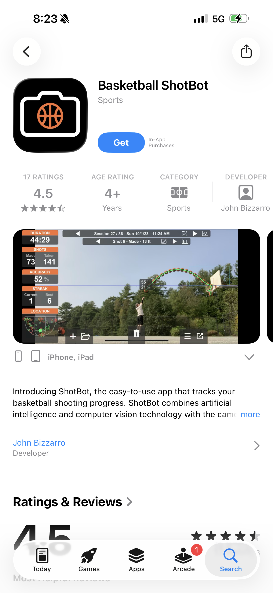
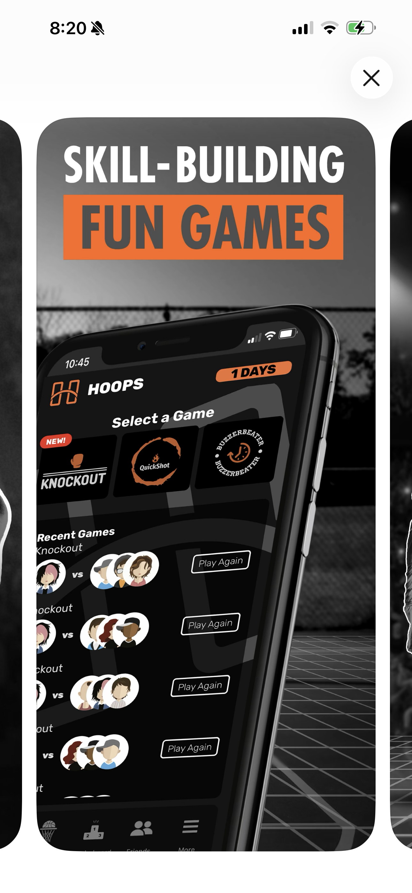

# Home Screen Design

## Research: Three Reference Apps

### Basketball ShotBot
- Video gallery, plus import, export, and delete on the current video

### SHRED
- Clean, aesthetically pleasing homepage with a bar at the bottom and a selection of short shooting/practice games at the top
- Loved the social aspect and nav bar at the bottom — maybe include a social aspect of some sort

### Hoops AI Basketball
- Include a short bar at the top, maybe with a streak bar; also have settings, profile, and other miscellaneous things on the top right

## Hex Colors

| Color | Hex | Use |
|---|---|---|
| Orange | `#FF6B1A` | Accent |
| Black | `#08090B` | Background |
| White | `#F8FAFC` | Text |

## Font

Inter

## Summary of Choices

I wanted this to be not just an analysis app, but also have a social aspect within it. So at the bottom, there are 4 navigation buttons: home, practice, community, and profile. The home page would have a summary of stats and buttons. The practice section would have more detailed practice stats. The upload button would be to upload a recording. The community would have leaderboards and other fun games. The profile would just be to connect information and other important data.

## Figma Link

https://www.figma.com/design/6UeLHnYen3ukAm9AAkV1dm/Untitled?node-id=2-905&t=mlOQlEcZTIR4Sun9-1
